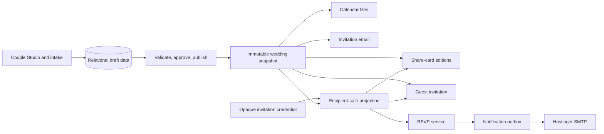

# Dyrane Weddings Delivery Roadmap

Status: active

Yardstick: Alexander and Chioma

Rule: no phase advances while an applicable gate in `VERIFICATION-MATRIX.md` is red.

## Architecture boundary

The immutable snapshot is the publishing seam. Presentation never reads authoring tables directly, and the spatial layer never owns facts or actions.

## Standard stack

| Concern | Standard | Guardrail |
| --- | --- | --- |
| Web platform | Next.js App Router, React, TypeScript | Server-first; client islands only for interaction |
| Styling | Tailwind plus semantic CSS variables | Themes may change tokens, never behavior contracts |
| Behavior | React Aria behind `ui/primitives` | No raw behavior-library imports in features |
| Icons | Lucide behind `ui/icons` | One meaning and one registered icon per action |
| DOM motion | Motion behind `ui/motion` | Native scroll; reduced-motion equivalent required |
| Spatial presentation | Three.js, React Three Fiber, Drei | Decorative island; static fallback; no semantic truth |
| Validation | Zod at every publish and mutation boundary | Invalid or unapproved content cannot publish |
| Share cards | Next.js `ImageResponse` | Deterministic 1200×630 output; editioned on publication |
| Calendar | `ics` | Only events allowed for that invitation are emitted |
| Persistence | PostgreSQL with Drizzle | Tenant-bound queries, migrations reviewed in CI |
| Email | Nodemailer through Hostinger SMTP, React Email templates | Transactional outbox; delivery never changes RSVP truth |
| Media | Object storage plus Sharp-derived variants | Rights, consent, focal point, dimensions, and provenance required |
| Testing | Vitest, Playwright, axe-core | Unit, contract, browser, privacy, and accessibility gates |
| Operations | Structured logs, error monitoring, privacy-safe product analytics | No guest identity or invitation credential in telemetry |

Future libraries are added only in the phase that exercises them. This keeps the dependency surface intentional and testable.

## Phase 0 — Foundation and guardrails

Deliver the route, snapshot, privacy, design, motion, icon, and verification contracts. The yardstick remains a clearly identified simulation; RSVP cannot pretend to submit.

Exit gate: clean build, schema tests, generic/private/invalid routes, deterministic cards, calendar projection, noindex and no-store privacy checks, semantic DOM, reduced-motion and no-WebGL fallback.

## Phase 1 — Yardstick art direction

Replace placeholder spatial geometry with commissioned/generated scene assets for the modern fairytale pop-up-book direction: envelope, story path, proposal object, architectural reveal, details card, and celebration close. Build mobile compositions separately from desktop and tune chapter boundaries from DOM section positions.

Locked yardstick direction: **Twilight Garden → Glass Pavilion**. The experience must feel like crossing into a wedding venue, not viewing a series of decorated sections.

Execution follows `BUILD-RUNBOOK.md`:

1. Reference lock and atmospheric stills.
2. Envelope-to-garden threshold vertical slice.
3. Story garden.
4. Wedding circle.
5. Pavilion and details.
6. RSVP place setting.
7. Atmosphere polish.
8. Reference-device release.

Research, art direction, storyboard and intake are now durable in `RESEARCH-DOSSIER.md`, `YARDSTICK-ART-BIBLE.md`, `SCENE-STORYBOARD.md` and `ASSET-INTAKE.md`. The couple-mark reference is recovered; its vector refinement, meaning and provenance approval remain explicit open items in `BRAND-MARK.md` and do not block environmental blockout.

Exit gate: approved storyboard and visual references; long-name and Unicode fixtures; 320–1440px layouts; 200% zoom; reverse-scroll; context loss; reference-device frame and Core Web Vitals budgets.

## Phase 2 — Publishing core

Introduce PostgreSQL authoring tables, immutable published revisions, consent and visibility approvals, media records, theme versions, and preview/publish/rollback controls. Generate stable share-card edition URLs from the published revision.

Exit gate: migrations reviewed; tenant isolation tests; draft data cannot leak; publication is atomic; previous revision rollback works; every public name and image has approval.

## Phase 3 — Guests and delivery

Add households, guests, event entitlements, revocable opaque invitations, public and personalized share flows, invitation email, delivery tracking, and resend controls. Store credential hashes only.

Exit gate: at least 128 bits of randomness; expiry/revocation; rate limits; log/referrer audit; public/private sharing warning; Hostinger SPF, DKIM, DMARC, bounce, and retry verification.

## Phase 4 — Real RSVP vertical slice

Implement attendance per event, plus-one policy, meal/accessibility questions, edit flow, idempotency key, transactional notification outbox, couple notification, and export.

Exit gate: submit, refresh, edit, retry, duplicate, concurrent update, email failure, export, and deletion journeys pass. A guest never sees success before the reply is committed.

## Phase 5 — Couple Studio

Build the structured authoring workspace: wedding identity, story, schedule, people and roles, vendors, dress guidance, imagery, guest policies, preview, approvals, and publication. Technical implementation words never enter couple-facing copy.

Exit gate: empty/partial/error states; autosave and recovery; role permissions; preview parity; publish checklist; audit history.

## Phase 6 — Progressive intake

Add the one-question-at-a-time orb experience with optional voice, visual prompts, save/resume, branching questions, image collection, AI-assisted suggestions, and explicit human confirmation before any fact becomes publishable.

Exit gate: full keyboard and screen-reader alternative; audio controls and transcript; interruption recovery; no dark patterns; every generated claim and asset shows provenance and approval state.

## Phase 7 — Reusable product and operations

Add theme packs, wedding provisioning, domain management, team roles, operational dashboards, analytics, backups, retention/deletion workflows, observability, support tooling, and disaster recovery.

Exit gate: second and third weddings launch without theme-specific source changes; load, security, backup restore, monitoring, rollback, and incident runbooks pass.

## UI/UX release gates

Every guest-facing increment must pass the five-second invitation test, one-primary-action test, keyboard/touch parity, 44px preferred target audit, WCAG 2.2 AA contrast and reflow, reduced/static motion parity, truthful feedback states, zero banned technical copy, and a manual craft review on real iOS and Android devices.
